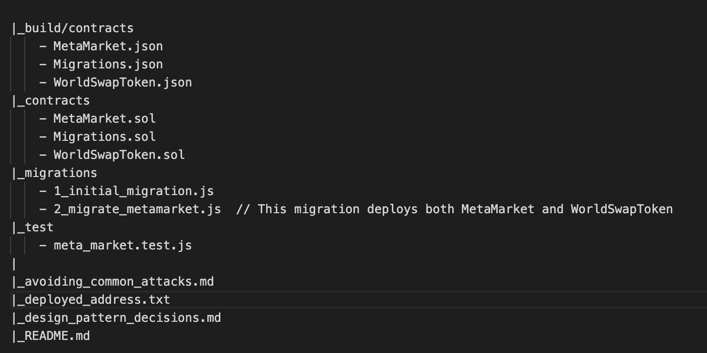

# blockchain-developer-bootcamp-final-project

## MetaMarket NFT Marketplace

The goal for this project is to create an NFT marketplace designed to buy and sell tokens strictly from metaverse games and projects.  

The project is designed as a Smart Contract which acts as an escrow agent between buyer and seller.

## How it works: 
1) The seller goes to the New Listing page of the MetaMarket website and connects their wallet
2) The seller then selects the asset they wish to sell (currently only ERC721 supported), populated based on the contents of their connected wallet
3) When the asset is selected, they enter a price and click the 'Create Listing' button
4) They will be asked by MetaMask to approve the transaction, which will call the `createListing()` function on the MetaMarket smart contract
5) `createListing()` will generate a listing record for the token/nft and transfer ownership to the MetaMarket contract
6) The seller will then be shown all the listings which they currently have for sale via MetaMarket

### Roadmap
6) A buyer can purchase the token/nft for the asking price
7) The MetaMarket contract will transfer the sale price to the seller and the token to the buyer.
8) A percentage transaction fee will be collected and kept in the MetaMarket contract

## Explanation
The main project is built around the `MetaMarket.sol` contract, which can currently `createListing()` and receive ERC721 tokens.
The `WorldSwapToken.sol` contract was built as a test token, to allow devs to create a ERC721 token, issue it to an address and list it in the MetaMarket contract.

The frontend is a rails project, with jquery and vanilla javascript and web3.js.  
It can be found at: https://metamarketfrontend.herokuapp.com/

### Directory Structure

## Testing Instructions

1) Navigate to https://metamarketfrontend.herokuapp.com/
2) Use the `Connect to Metamask` button to connect your wallet
3) Mint yourself a new `$SWAP` token or two for testing
4) Click the `Sell` button to go the `New Listing` page
5) You should see a list of all tokens available to sell, with the unique `tokenId` listed on the righthand side
6) Open the developer console to get better feedback (more UI work needed here)
7) Select a token to list, enter a sale price in the modal and click `Create Listing`
8) You will be prompted by MetaMask to confirm the first transaction.  This is an `approve()` call to allow MetaMarket to transfer the token
9) If successful, you will be prompted again to call the `createListing()` method
  -> Note working on a solution to improve this workflow
10) When the listing is succesfully created, you will be redirect to the `My Listings` page. This is populated by pulling a list of all tokens held by the MetaMarket contract where the seller is listed as the current MetaMask account.
11) Navigate to the [Ropsten Etherscan page](https://ropsten.etherscan.io/address/0x28842b54dFB29bDCe18a334130c441924D66b248) for the contract to confirm the transaction was successful and that the $SWAP tokens are now held by the contract.

---

ETH address for certificate: 0x???

